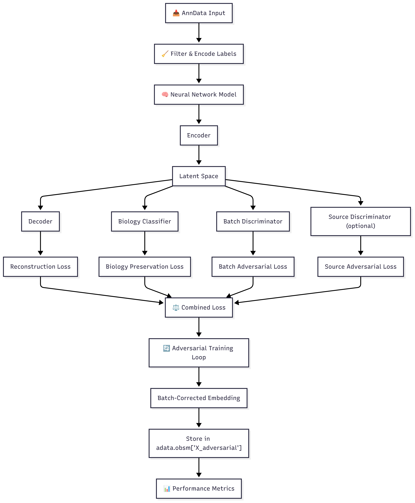

# 🧬 ScAdver — Adversarial Batch Correction for Single-Cell Data.

ScAdver is a lightweight Python package for adversarial batch correction in single-cell data 🧪. 
It offers a compact, well-documented pipeline with core modules:
scadver.core & scadver.model 📦 — plus an example workflow (pancreas_example.py) and UMAP visualizations so you can reproduce results in minutes ⏱️.

💡 Focus: Reference-only training + adversarial learning to remove technical batch effects while preserving biological signal.

## 🔬 Project Workflow

🚀 Key Features

•  🗂 Reference-only training & query mapping — no query data leakage during training.

•  🛡 Adversarial batch discriminator — reduces batch-specific signals.

•  🧩 Biology classifier — preserves cell-type structure.

•  📜 Example scripts & figures — end-to-end reproducibility.

•  📦 PyPI-style packaging with setup.py & open-source LICENSE.

## Workflow Steps



1. **Input Preparation**
   * Takes an AnnData object (adata) with features and metadata.
   * Requires column names for biological labels (bio_label, e.g., Celltype) and batch labels (batch_label, e.g., Batch).
   * Optionally, reference/query source labels for domain adaptation.

2. **Data Filtering & Encoding**
   * Filters out cells with missing biological labels.
   * Encodes biological and batch labels as integers for neural network training.
   * Optionally encodes source labels for reference-query setup.

3. **Model Architecture**
   * **Encoder**: Deep feedforward network maps input features to a latent space.
   * **Decoder**: Reconstructs input from latent space (for signal preservation).
   * **Biology Classifier**: Predicts biological labels from latent space (to preserve biology).
   * **Batch Discriminator**: Predicts batch labels from latent space (to remove batch effects).
   * **Source Discriminator** (optional): Predicts source labels for reference-query alignment.

4. **Adversarial Training Loop**
   * **Reference-Query Mode**: When `reference_data` and `query_data` are specified, the model trains ONLY on Reference samples to maintain unbiased batch correction. Query samples have no influence on training parameters.
   * **Standard Mode**: When no reference-query split is specified, trains on all available samples.
   * **Main Loss**: Combines reconstruction loss, biology preservation loss (weighted), and adversarial batch loss (weighted negative).
   * **Discriminator Losses**: Batch and source discriminators are trained to correctly classify batches/sources, while the encoder is trained to fool them.
   * **Gradient Clipping**: Ensures stable training.

5. **Embedding Generation**
   * After training, the encoder transforms all cells (both Reference and Query) into a batch-corrected latent space.
      * The new embedding is stored in `adata_corrected.obsm['X_ScAdver']`.

6. **Performance Metrics**
   * Calculates silhouette scores for biology and batch mixing.
   * Returns batch correction score, biology preservation score, and overall score.
   * If reference-query is used, also returns source integration score.

## Installation

### From Source
```bash
git clone https://github.com/shivaprasad-patil/ScAdver.git
cd ScAdver
pip install .
```

### Development Installation
```bash
git clone https://github.com/shivaprasad-patil/ScAdver.git
cd ScAdver
pip install -e ".[dev]"
```

## Quick Start

```python
import scanpy as sc
from scadver import adversarial_batch_correction

# Load your single-cell data
adata = sc.read("your_data.h5ad")

# Run adversarial batch correction
adata_corrected, model, metrics = adversarial_batch_correction(
    adata=adata,
    bio_label='celltype',     # Column name for biological labels
    batch_label='batch',      # Column name for batch labels
    reference_data='Reference',  # Optional: reference data identifier
    query_data='Query',          # Optional: query data identifier
    latent_dim=256,           # Latent embedding dimension
    epochs=500,               # Number of training epochs
    device='auto'             # Device: 'auto', 'cuda', 'mps', 'cpu'
)

# Access the corrected embedding
corrected_embedding = adata_corrected.obsm['X_ScAdver']

# Compute UMAP on corrected data
sc.pp.neighbors(adata_corrected, use_rep='X_ScAdver')
sc.tl.umap(adata_corrected)

# Visualize results
sc.pl.umap(adata_corrected, color=['celltype', 'batch'])
```

## Parameters

### Required Parameters
- `adata`: AnnData object containing single-cell data
- `bio_label`: Column name for biological labels to preserve (e.g., 'celltype')
- `batch_label`: Column name for batch labels to correct (e.g., 'batch')

### Optional Parameters
- `reference_data`: Value identifying reference data in 'Source' column
- `query_data`: Value identifying query data in 'Source' column
- `latent_dim`: Dimensionality of latent embedding (default: 256)
- `epochs`: Number of training epochs (default: 500)
- `learning_rate`: Learning rate for optimizers (default: 0.001)
- `bio_weight`: Weight for biology preservation loss (default: 20.0)
- `batch_weight`: Weight for batch adversarial loss (default: 0.5)
- `device`: Device for training ('auto', 'cuda', 'mps', 'cpu')

## Output

The function returns three objects:
1. `adata_corrected`: AnnData object with corrected embedding in `obsm['X_ScAdver']`
2. `model`: Trained AdversarialBatchCorrector model
3. `metrics`: Dictionary containing performance metrics

### Metrics
- `biology_preservation`: Biology preservation score (higher is better)
- `batch_correction`: Batch correction score (higher is better)
- `overall_score`: Overall performance score
- `source_integration`: Source integration score (if reference-query setup)

## Requirements

- Python >= 3.8
- PyTorch >= 1.12.0 (with MPS support for Apple Silicon)
- NumPy >= 1.20.0
- pandas >= 1.3.0
- scikit-learn >= 1.0.0
- scanpy >= 1.8.0
- anndata >= 0.8.0

## Citation

If you use ScAdver in your research, please cite:

```bibtex
@software{scadver2025,
  title={ScAdver: Adversarial Batch Correction for Single-Cell},
  author={Shivaprasad Patil},
  year={2025},
  url={https://github.com/shivaprasad-patil}
}
```

## License

This project is licensed under the Apache 2.0 License - see the LICENSE file for details.

## Contributing

Contributions are welcome! Please feel free to submit a Pull Request.
