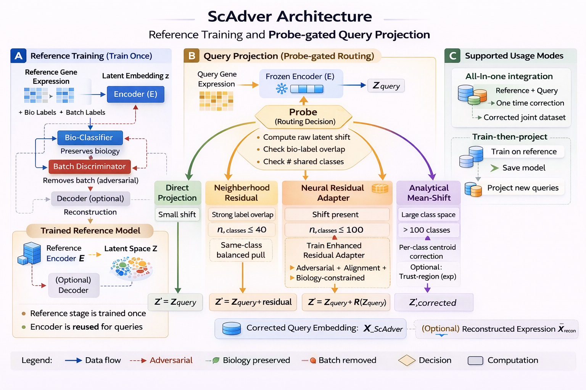

# 🧬 ScAdver — Adversarial Batch Correction for Single-Cell Data

ScAdver eliminates technical batch effects from single-cell RNA-seq data while preserving biological variation and cell type identity. It follows a **train-once, project-forever** paradigm — train on reference data, then rapidly project unlimited query batches without retraining.



## Key Features

- ✅ **Train once, project forever** — reuse the trained encoder across any number of query batches
- 🔒 **Fully reproducible** — `set_global_seed()` seeds every random operation
- 🎯 **Biology preserved** — adversarial discriminator removes batch effects without touching biological signal
- 🏗️ **Enhanced residual adapter** — 3-layer, LayerNorm, GELU, Tanh-bounded with learnable scale
- 📐 **Distribution alignment** — MMD + Moment-Matching + CORAL losses for robust domain adaptation
- 🤖 **Automatic domain shift detection** — measures residual magnitude ‖R(z)‖ and decides whether an adapter is needed
- 🖥️ **Multi-device** — CPU, CUDA, and Apple Silicon (MPS)

## Installation

```bash
pip install git+https://github.com/shivaprasad-patil/ScAdver.git
```

## Workflows

### Workflow 1 — All-in-One Batch Correction

Pass all data in a single call. The model trains on everything and returns corrected embeddings and reconstructed expression.

**✅ Use when** all data is available upfront and no new query batches are expected.

```python
from scadver import adversarial_batch_correction, set_global_seed
set_global_seed(42)
adata_corrected, model, metrics = adversarial_batch_correction(
    adata=adata, bio_label='celltype', batch_label='batch',
    epochs=500, device='auto', return_reconstructed=True, seed=42,
)
```

---

### Workflow 2 — Reference → Query (Train-Then-Project)

Split data into reference and query yourself, train on reference only, then project query batches automatically. `transform_query_adaptive` probes for domain shift and trains a residual adapter only when needed.

**✅ Use when** query batches arrive over time, come from a different protocol, or you want to deploy a reusable model.

→ See **[examples/pancreas_example.py](examples/pancreas_example.py)** (script) or **[examples/query_projection_notebook.ipynb](examples/query_projection_notebook.ipynb)** (notebook)

---

### Which to choose?

| Scenario | Workflow |
|----------|----------|
| All data available, one-time analysis | **1** — All-in-One |
| Query batches arrive over time | **2** — Train-Then-Project |
| Large protocol shift (e.g. 10X → Smart-seq2) | **2** — adaptive projection |
| Deploying as a service / reusable model | **2** — Train-Then-Project |

## Output

| Key | Description |
|-----|-------------|
| `adata.obsm['X_ScAdver']` | 256-d batch-corrected latent embeddings — input to UMAP, clustering, trajectory, etc. |
| `adata.layers['ScAdver_reconstructed']` | Batch-corrected gene expression — input to DE, gene programs, etc. (requires `return_reconstructed=True`) |
| `metrics` | `biology_preservation`, `batch_correction`, `overall_score` |

## How It Works

The encoder is trained adversarially:
- A **bio-classifier** pushes the encoder to retain cell-type signal
- A **batch discriminator** pushes the encoder to discard technical batch signal

For cross-protocol queries, `transform_query_adaptive` trains an `EnhancedResidualAdapter` on top of the frozen encoder, minimising adversarial + MMD + CORAL + moment-matching + biology losses with warmup scheduling and early stopping.

Full technical details: [ENCODER_MECHANISM_EXPLAINED.md](ENCODER_MECHANISM_EXPLAINED.md) · [RESIDUAL_ADAPTER.md](RESIDUAL_ADAPTER.md)

## Citation

```bibtex
@software{scadver2025,
  title={ScAdver: Adversarial Batch Correction for Single-Cell},
  author={Shivaprasad Patil},
  year={2025},
  url={https://github.com/shivaprasad-patil/ScAdver}
}
```

## License

Apache 2.0 — see [LICENSE](LICENSE).

